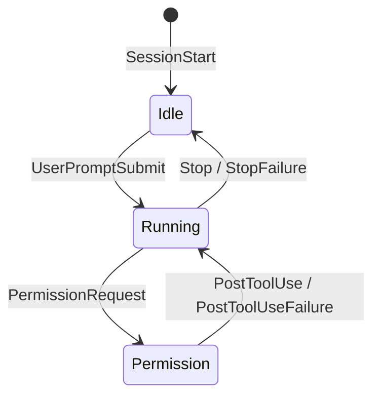
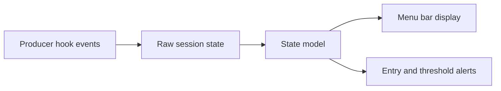

# Event-Only Session State Design

**Date:** 2026-07-21

## Summary

Remove CPU-based activity detection from session state evaluation and make
producer events the only source of state transitions. Keep the permission nag
threshold at 300 seconds by default to absorb the missing post-approval event
for most commands. Accept that an approved command lasting longer than the
threshold may produce one false permission nag.

This decision follows runtime observation showing that CPU usage is not a
stable signal of approval or tool execution. Both agent versions and machine
workloads can change the background CPU baseline, making any fixed threshold
inherently fragile.

## Current Hook Constraint

The current Claude Code and Codex hook lifecycle provides these relevant
events:



There is no hook for the moment when the user approves a permission dialog.
`PreToolUse` runs before permission evaluation, `PermissionRequest` runs when
the dialog is shown, and `PostToolUse` / `PostToolUseFailure` run only after the
tool finishes. Therefore an event-only consumer cannot distinguish these two
periods:

1. A tool is waiting for user approval.
2. The user approved it and the tool is still running.

The existing CPU heuristic attempted to bridge this gap by displaying a raw
`permission` state as `running` whenever the agent process tree used at least
3% CPU.

## Observation Instrumentation

The `feat/add-cpu-observation-logging` branch added opt-in JSONL observation at
five-second intervals. Each live session record includes:

- Agent and session identity.
- Raw and CPU-adjusted effective states.
- Total process-tree CPU and per-process CPU.
- CPU threshold crossings and activity override application.
- Raw and effective state changes.
- Requested sound name and reason (`entry` or `threshold`).
- State and snapshot ages.
- App-instance and sample identifiers.

Command arguments are deliberately excluded. Logs rotate at 10 MiB by default.

## Observed Facts

### CPU differs materially by agent and workload

During an initial short observation window, Codex was actively being used and
showed substantially more CPU activity than an untouched Claude process. This
was expected and demonstrated that raw crossing counts cannot be interpreted
as false positives without considering the raw session state.

Only this sequence is relevant to the notification bug:

```text
raw_state = permission
effective_state = permission -> running -> permission
raw_state and since remain unchanged
a sound is emitted on the return to permission
```

### Untouched Claude crosses the 3% threshold

An untouched Claude process produced short CPU spikes during the observation:

| Time | Process-tree CPU |
| --- | ---: |
| 02:37:59 | 4.8% |
| 02:39:09 | 3.1% |
| 02:40:39 | 3.3% |
| 02:43:44 | 3.4% |

These spikes show that 3% is not a reliable boundary between a permission
dialog and an executing tool. Raising the threshold would only move the
failure boundary and would remain sensitive to future Claude Code, Codex, MCP,
runtime, and machine changes.

### A CPU round trip caused the unexpected permission sound

The unexpected sound reported during observation had this timeline:

```text
02:43:44
raw_state:       permission
effective_state: running
tree CPU:        3.4%
sound:           none

02:43:49
raw_state:       permission (unchanged)
effective_state: permission
tree CPU:        0.2%
sound:           Glass, reason=threshold
```

The permission episode was approximately 2 hours and 41 minutes old. No hook
event or `since` change occurred. The CPU override temporarily removed the
episode from the alert bookkeeping, and the return below the threshold armed
and emitted the threshold nag again.

This confirms that the current implementation violates the original
"display-only override" intent: the effective state also controls entry and
alert-once bookkeeping.

### Multiple old snapshots shared one live Claude PID

The same live Claude root PID was associated with both an old `idle` snapshot
and an old `permission` snapshot. Both were approximately 2 hours and 41
minutes old and inherited the same CPU sample. The current stale policy retains
them because the PID is alive and `updated_at` is less than 24 hours old.

This is independent of the CPU heuristic. Removing CPU evaluation stops the
repeat re-arming behavior, but an old permission snapshot can still blink and
can emit one threshold nag after the status app restarts.

### A separate Codex sound was legitimate but delayed

A later Codex sequence was initially mistaken for the reported sound:

```text
raw running -> raw permission
CPU above 3% kept effective state at running
CPU fell below 3% about four seconds later
the permission entry sound then fired
```

This was a genuine new `PermissionRequest`, but CPU adjustment shifted the
sound away from the event time. Even when it does not create a duplicate, the
heuristic makes notification timing less predictable.

## Decision

### Events are the only state source

The consumer will evaluate the producer's raw state without CPU adjustment:



CPU sampling will not affect display state, blinking, entry sounds, threshold
sounds, or alert bookkeeping.

### Keep the five-minute permission threshold

Keep `permission_alert_sec` at its current default of 300 seconds. A genuine
permission request still emits its entry sound immediately. The threshold nag
is only a follow-up reminder.

After approval, raw state remains `permission` until the tool completes. Most
commands finish within five minutes, so `PostToolUse` or `PostToolUseFailure`
will return the state to `running` before the nag. An approved command lasting
more than five minutes may emit one false threshold nag and remain displayed as
permission until completion.

This is an explicit, deterministic limitation. Users with frequent long-running
commands can raise `permission_alert_sec` to 600 or 900 seconds.

### Prefer a bounded false positive over heuristic false transitions

The accepted trade-off is:

- At most one threshold nag for an approved command exceeding the configured
  delay.
- No CPU-dependent state transitions.
- No repeat re-arming from CPU fluctuations.
- Behavior that is reproducible from hook events and timestamps alone.

## Snapshot Lifecycle Requirement

Event-only evaluation does not by itself solve old session files sharing a
live PID. The implementation must also prevent superseded snapshots from
participating in display and alert evaluation.

For snapshots with the same `(agent, pid)`, retain only the most recently
updated snapshot as active. Treat the older snapshots as superseded and remove
their state files using the existing agent-specific deletion routing.

This rule assumes one current session per agent process. Before finalizing the
implementation, tests must lock down resume and session-ID replacement behavior
for each supported producer. If a supported agent can legitimately expose
multiple simultaneous session IDs from one process, the producer contract must
instead provide a stronger lifecycle identifier or explicitly delete the
superseded state file.

The existing dead-PID and 24-hour stale cleanup remains as a fallback.

## Configuration Changes

Remove these behavior settings from the documented configuration:

- `activity_detection`
- `activity_cpu_threshold_pct`

Old configuration files containing these keys remain valid; unknown keys are
ignored. No migration is required.

Keep:

- `permission_alert_sec`, default 300.
- `idle_alert_sec`, default 300.
- Entry sound overrides.
- `sound_cooldown_sec` for spacing threshold nags.
- Blink configuration.

## Observation Logging Disposition

The CPU observation feature served its diagnostic purpose and confirmed the
failure mechanism. It should not become a permanent user-facing feature in the
event-only implementation unless there is a separate need for a general
diagnostic mode.

Preferred implementation outcome:

1. Preserve this design document as the investigation record.
2. Remove CPU observation logging, its configuration, process-tree detail, and
   documentation from the final behavior change.
3. Keep sound events associated with agent and session internally only if that
   structure materially improves tests or future diagnostics.

The runtime JSONL files are local diagnostic artifacts and are not committed.

## Implementation Scope

1. Remove CPU sampling and effective-state override from `main.swift`.
2. Remove activity adjustment from `StateModel.evaluate` and simplify its API.
3. Remove CPU activity configuration and README entries.
4. Remove `ProcessProbe.treeCPU`; retain PID liveness support.
5. Remove the temporary CPU observation logger and tests.
6. Add same-agent/same-PID snapshot supersession before state evaluation.
7. Delete superseded state files through their agent-specific directories.
8. Preserve the 300-second permission threshold.
9. Update the permanent design documentation and known limitations.

## Required Tests

- A raw `permission` session never becomes `running` without a producer event.
- A permission entry sound fires exactly once on a genuine raw transition.
- A permission threshold sound fires once at 300 seconds by default.
- Repeated evaluation cannot re-arm an unchanged waiting episode.
- A tool completing before 300 seconds returns to `running` without a
  threshold sound.
- A tool represented as permission for more than 300 seconds emits one nag and
  no repeats.
- App restart with an over-threshold permission episode has the explicitly
  chosen startup behavior locked down.
- For the same agent and PID, only the newest snapshot is evaluated and older
  snapshots are returned for deletion.
- Identical session IDs belonging to different agents remain independent.
- Dead-PID and 24-hour stale cleanup continues to work.
- Configuration files containing removed activity keys still parse safely.

## Acceptance Criteria

- No code path samples CPU to infer a session state.
- Display, blink, and sounds can be explained entirely by producer events,
  `since`, configuration, and app-local alert-once bookkeeping.
- An unchanged permission episode cannot emit another sound because of process
  activity.
- Superseded same-agent/same-PID snapshots do not display, blink, or alert.
- The default permission follow-up nag remains five minutes.
- All unit tests and the release build pass.
